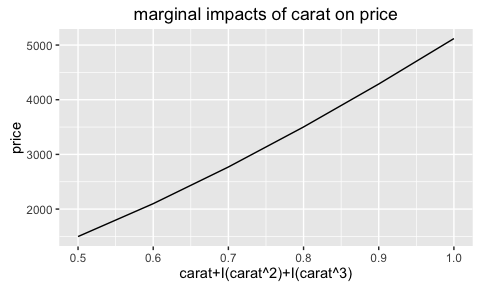
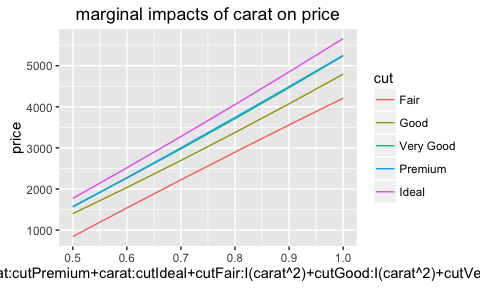
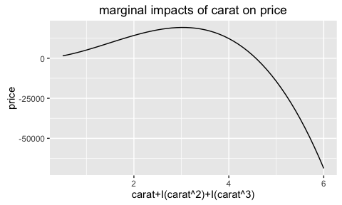
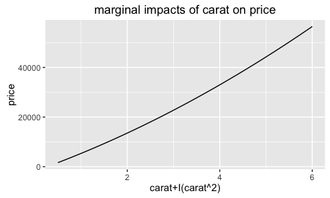
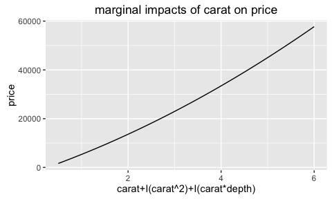
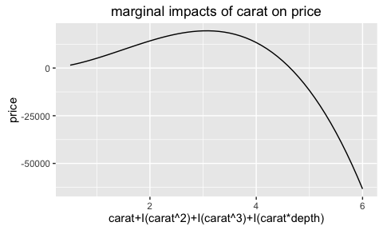

# <center> <h1> linear.tools </h1> </center> <center> <h1>  </h1> </center>
</center> <font size="4">Fan Yang</font> </center>  
2015-08-10 <center> <h1>  </h1> </center>  

<center> <h1>  </h1> </center> 

Abstract:

This package enables "marginal effect regularization" in stepwise algorithm.

Traditional machine learning algorithms only try to achieve lowest loss or max likelihood; they did not bring prior knowledge of economic theory or business justification into model learning.
That means, a feature with a wrong marginal impact on the dependent may be selected solely based on statistical soundness, despite that is contradictory to economic theory.

This package enables one to put the direction or relative magnitude of marginal effect as constraints in the iteration process of stepwise algorithm, thus bringing prior knowledge of marginal effect into model learning. 


<center> <h1>  </h1> </center> 


This package has two parts: 

  * The first part provides tools to manipulate formulas.
  * The second part provides functions to evaluate and check the marginal impacts of a linear model.


# First Part: Manipulate formulas
### different forms of x

Variables in R's linear formula/model can have different forms:

  1.  Model variables, the items showed up directly in the formula, separated by the '+' sign.
  2.  Raw variables, the underlying variables used.
  3.  Coefficient variables, the coefficient names; note that un-evaluated formulas don't have those variables.

### model variables: `get_x(formula/model,'coeff')`

```r
data = ggplot2::diamonds
diamond_lm  =  lm(log(price)~  I(carat^   2) + cut  + carat + table + carat:table, data)
```

At the first sight, the linear model above contains 5  variables:

* I(carat^   2)
* cut
* carat
* table
* carat:table

In linear.tools we call them *model* variables and can access them using function `get_x(.,'model')`:


```r
get_x(diamond_lm,'model')
```

```
## [1] "I(carat^2)"  "cut"         "carat"       "table"       "carat:table"
```


Note that in the original formula, there are redundant spaces 'I(carat^   2)'; in `get_x(.,'model')` we deleted them.

### raw variables: `get_x(formula/model,'coeff')`

Sometimes you want to get the underlying raw variables used in the formula, which are

* carat (the underlying variable for I(carat^   2))
* cut
* carat
* table

In linear.tools we call them *raw* variables and can access them using function `get_x(.,'raw')`:


```r
get_x(diamond_lm,'raw')
```

```
## [1] "carat" "cut"   "table"
```

`get_x(.,'model')` will show the linkage between model variables and raw variables: it will return a list with names as model variables and elements as their corresponding raw variables.

```r
get_model_pair(diamond_lm, data, 'raw')
```

```
## $`I(carat^2)`
## [1] "carat"
## 
## $cut
## [1] "cut"
## 
## $carat
## [1] "carat"
## 
## $table
## [1] "table"
## 
## $`carat:table`
## [1] "carat" "table"
```


### coefficient variables: `get_x(model,'coeff')`

Sometimes you want the the coefficient names of the model


```r
get_x(diamond_lm,'coeff')
```

```
## [1] "I(carat^2)"  "cut.L"       "cut.Q"       "cut.C"       "cut^4"      
## [6] "carat"       "table"       "carat:table"
```


You may also want to see how 'model' variables are linked with 'coeff' variables: `get_x(.,'coeff')` will return a list with names as model variables and elements as their corresponding coeff variables.


```r
get_model_pair(diamond_lm, data, 'coeff')
```

```
## $`I(carat^2)`
## [1] "I(carat^2)"
## 
## $cut
## [1] "cut.L" "cut.Q" "cut.C" "cut^4"
## 
## $carat
## [1] "carat"
## 
## $table
## [1] "table"
## 
## $`carat:table`
## [1] "carat:table"
```


### link different forms of x: `get_x_all(model)`

The `get_x_all()` function will return a data.frame showing all the model variables and their corresponding raw & coefficient variables.


```r
get_x_all(model = diamond_lm)
```

```
##     raw       model       coeff n_raw_in_model
## 1 carat  I(carat^2)  I(carat^2)              1
## 2   cut         cut       cut.L              1
## 3   cut         cut       cut.Q              1
## 4   cut         cut       cut.C              1
## 5   cut         cut       cut^4              1
## 6 carat       carat       carat              1
## 7 table       table       table              1
## 8 carat carat:table carat:table              2
## 9 table carat:table carat:table              2
```


### get y : `get_y(formula/model)`


```r
get_y(diamond_lm,'raw')
```

```
## [1] "price"
```

```r
get_y(diamond_lm,'model')
```

```
## [1] "log(price)"
```


## contrast: get_contrast(model)

Contrasts are how categorical variables show up in coefficients.

When R evaluate categorical variables in the linear model, R will transform them into sets of 'contrasts' using certain contrast encoding schedule. See [UCLA idre](http://www.ats.ucla.edu/stat/r/library/contrast_coding.htm) for details.

For example, for categorical variable 'cut' in the above model, we can get its contrasts through function `get_contrast`


```r
# get_contrast will return a list with each element as the contrasts of a categorical variable in the model
get_contrast(diamond_lm)
```

```
## $cut
## [1] "cut.L" "cut.Q" "cut.C" "cut^4"
```

You can also return the contrast method.

```r
get_contrast(diamond_lm, return_method = T)
```

```
## $cut
## contr.poly
```


# Second Part: Evaluate Marginal Effect

In formula `y ~ a + I(a^2) + b`, We define 'Marginal Effect' of `a` on `y` as: fixing `b`, how the change of `a` will affect value of `y`. Note that the marginal effect here is not just the coefficients for `a` and `I(a^2)`, neither the sum.

### evaluate marginal effect: `effect`
We provide a easy tool to show the marginal effect and check its monotonicity. The example below will evaluate how the `carat` of the diamond will affect its `price` in a particular model.


```r
# more carats, higher price.
diamond_lm3 = lm(price~  carat + I(carat^2) + I(carat^3) , ggplot2::diamonds) # a GLM

test1 = effect(model = diamond_lm3, focus_var_raw = c('carat'), focus_value =list(carat = seq(0.5,1,0.1))) 
```

<!-- -->

```r
test1$Monoton_Increase
```

```
## [1] TRUE
```
You can see that the model did a good job to model monotonic increasing relations between `carat` and `price` when `carat` ranges from 0.5 to 1 (`$Monoton_Increase` is `True`).

PS: A more interesting case is that, if you interact `carat` with the categorical variable `cut`, you can examine the marginal effects `carat` under different categories of `cut`

```r
test_interaction = effect(model = lm(price~  carat*cut + I(carat^2)*cut, ggplot2::diamonds), 
       focus_var_raw = c('carat','cut'), focus_value =list(carat = seq(0.5,1,0.1))
       ) 
```

<!-- -->


However, in the model `diamond_lm3` when we let the `carat` ranges from 0.5 to 6, the model failed to get the monotonic increasing relations: in the model below, when carat is larger than 3 approximately, the higher the carat, the lower the price!
  

```r
test2 = effect(model = diamond_lm3, focus_var_raw = c('carat'), focus_value =list(carat = seq(0.5,6,0.1))) 
```

<!-- -->

```r
test2$Monoton_Increase
```

```
## [1] FALSE
```


### delete the marginal effect and re-evaluate

When a model has a wrong marginal effect, we can use function `deleting_wrongeffect` to delete a model variable that potentially causes the wrong marginal impacts and then re-estimate the model. This function can keep doing this until the correct marginal impacts are found.

The example below will

  * first test the marginal effect of carat on price, which is supposed to be monotonic increasing.
  * then as it finds incorrect marginal effect, it will delete one model variable that contains `carat` in the most right, and then recheck the marginal effect.
  * It will keep doing the same thing until the marginal effect is correct, or all model variables containing `carat` are deleted.


```r
model_correct_effect = deleting_wrongeffect(model = diamond_lm3,
                                            focus_var_raw = 'carat',
                                            focus_value = list(carat=seq(0.5,6,0.1)),
                                            data = ggplot2::diamonds,
                                            PRINT = T,STOP =F, PLOT = T,
                                            Reverse = F)
```

```
## 
## initial model: 
##               Estimate     Pr(>|t|)
## (Intercept)  -198.3337 3.930283e-11
## carat         812.3639 1.540245e-19
## I(carat^2)   5813.2637 0.000000e+00
## I(carat^3)  -1308.8438 0.000000e+00
## 
## 
## check raw var:  carat 
## check model var:  carat, I(carat^2), I(carat^3) 
## Correct Monotonicity is supposed to be:  Increasing
```

<!-- -->

```
## Monotonicity is incorrect 
## Variable  I(carat^3)  shall be deleted, and the model shall be re-estimated. 
## -------------------------------------------------------
## 
## New Model: 
##               Estimate      Pr(>|t|)
## (Intercept) -1832.5774  0.000000e+00
## carat        6677.0273  0.000000e+00
## I(carat^2)    507.9133 9.695712e-131
## 
## 
## check raw var:  carat 
## check model var:  carat, I(carat^2) 
## Correct Monotonicity is supposed to be:  Increasing
```

<!-- -->

```
## Monotonicity is correct
```

```r
model_correct_effect
```

```
## 
## Call:  glm(formula = Formula_new, family = family, data = data0)
## 
## Coefficients:
## (Intercept)        carat   I(carat^2)  
##     -1832.6       6677.0        507.9  
## 
## Degrees of Freedom: 53939 Total (i.e. Null);  53937 Residual
## Null Deviance:	    8.585e+11 
## Residual Deviance: 1.279e+11 	AIC: 944900
```

### stepwise regression with correct marginal effect

Stepwise regression is popular in variable selection, but it failed to consider the correctness of marginal effects. `stepwise2` enables checking the marginal effects during each step of iteration in stepwise regression; so in each step we will skip those models with wrong marginal effects, and only only choose models among those that have correct marginal effect.

The example below is to use stepwise regression to find the model with highest BIC and with the correct marginal effect.


```r
scope = list(lower = price ~ 1,
             upper = price ~  carat + I(carat^2) + I(carat^3) + I(carat * depth) + depth)


### specify the correct marginal effect here
test_suit = list(
  carat = list( # the list name must be the raw var
    focus_var_raw = "carat", # must specify the focus_var_raw (see deleting_wrongeffect() ) as the raw var
    focus_value = list(carat=seq(0.5,6,0.1))
  )
)

model_correct_effect =  stepwise2(model = diamond_lm3, scope = scope, trace = T,
                                  data = ggplot2::diamonds, STOP = F, test_suit = test_suit)
```

```
## 
##  price ~ carat+I(carat^2)+I(carat^3) 
## ------------------------
##  price ~ carat+I(carat^2)+I(carat^3) + I(carat*depth) 
## ------------------------
##  price ~ carat+I(carat^2)+I(carat^3) + depth 
## ------------------------
##  price ~ carat+I(carat^2)+I(carat^3) - carat 
## ------------------------
##  price ~ carat+I(carat^2)+I(carat^3) - I(carat^2) 
## ------------------------
##  price ~ carat+I(carat^2)+I(carat^3) - I(carat^3) 
## ------------------------
##                        IC nvar step_count correct_effect_ind
## + I(carat*depth) 938807.6    4          1                  0
## + depth          939091.3    4          1                  0
## origin           939528.7    3          1                  0
## - carat          939608.4    2          1                  0
## - I(carat^3)     944876.6    2          1                  1
## - I(carat^2)     945450.7    2          1                  1
## 
## 
## 
##  price ~ carat+I(carat^2) 
## ------------------------
##  price ~ carat+I(carat^2) + I(carat^3) 
## ------------------------
##  price ~ carat+I(carat^2) + I(carat*depth) 
## ------------------------
##  price ~ carat+I(carat^2) + depth 
## ------------------------
##  price ~ carat+I(carat^2) - carat 
## ------------------------
##  price ~ carat+I(carat^2) - I(carat^2) 
## ------------------------
##                        IC nvar step_count correct_effect_ind
## + I(carat^3)     939528.7    3          2                  0
## + I(carat*depth) 943888.0    3          2                  1
## + depth          944394.5    3          2                  1
## origin           944876.6    2          2                  1
## - I(carat^2)     945466.5    1          2                  1
## - carat          962398.3    1          2                  1
## 
## 
## 
##  price ~ carat+I(carat^2)+I(carat*depth) 
## ------------------------
##  price ~ carat+I(carat^2)+I(carat*depth) + I(carat^3) 
## ------------------------
##  price ~ carat+I(carat^2)+I(carat*depth) + depth 
## ------------------------
##  price ~ carat+I(carat^2)+I(carat*depth) - carat 
## ------------------------
##  price ~ carat+I(carat^2)+I(carat*depth) - I(carat^2) 
## ------------------------
##  price ~ carat+I(carat^2)+I(carat*depth) - I(carat*depth) 
## ------------------------
##                        IC nvar step_count correct_effect_ind
## + I(carat^3)     938807.6    4          3                  0
## + depth          943753.7    4          3                  1
## origin           943888.0    3          3                  1
## - I(carat^2)     944552.6    2          3                  1
## - I(carat*depth) 944876.6    2          3                  1
## - carat          946883.6    2          3                  1
## 
## 
## 
##  price ~ carat+I(carat^2)+I(carat*depth)+depth 
## ------------------------
##  price ~ carat+I(carat^2)+I(carat*depth)+depth + I(carat^3) 
## ------------------------
##  price ~ carat+I(carat^2)+I(carat*depth)+depth - carat 
## ------------------------
##  price ~ carat+I(carat^2)+I(carat*depth)+depth - I(carat^2) 
## ------------------------
##  price ~ carat+I(carat^2)+I(carat*depth)+depth - I(carat*depth) 
## ------------------------
##  price ~ carat+I(carat^2)+I(carat*depth)+depth - depth 
## ------------------------
##                        IC nvar step_count correct_effect_ind
## + I(carat^3)     938779.0    5          4                  0
## origin           943753.7    4          4                  1
## - depth          943888.0    3          4                  1
## - I(carat*depth) 944394.5    3          4                  1
## - I(carat^2)     944466.4    3          4                  1
## - carat          945118.7    3          4                  1
```

```r
# the returned model
model_correct_effect
```

```
## 
## Call:  glm(formula = price ~ carat + I(carat^2) + I(carat * depth) + 
##     depth, family = family, data = data)
## 
## Coefficients:
##      (Intercept)             carat        I(carat^2)  I(carat * depth)  
##          -8695.2           20984.0             555.1            -233.1  
##            depth  
##            111.7  
## 
## Degrees of Freedom: 53939 Total (i.e. Null);  53935 Residual
## Null Deviance:	    8.585e+11 
## Residual Deviance: 1.253e+11 	AIC: 943800
```

### compare with `step`
The model using `stepwise2` got correct marginal effect:


```r
test_model_correct_effect = effect(model = model_correct_effect, focus_var_raw = c('carat'), focus_value =list(carat = seq(0.5,6,0.1))) 
```

<!-- -->

whereas the model using traditional algorithm `step` got wrong marginal effect:
  

```r
model_wrong_effect =  step(diamond_lm3, scope = scope, trace = F, data = ggplot2::diamonds)
model_wrong_effect
```

```
## 
## Call:
## lm(formula = price ~ carat + I(carat^2) + I(carat^3) + I(carat * 
##     depth) + depth, data = ggplot2::diamonds)
## 
## Coefficients:
##      (Intercept)             carat        I(carat^2)        I(carat^3)  
##         -3373.61          10638.46           5650.71          -1261.05  
## I(carat * depth)             depth  
##          -156.54             50.77
```

```r
test_wrong_effect = effect(model_wrong_effect, focus_var_raw = c('carat'), focus_value =list(carat = seq(0.5,6,0.1))) 
```

<!-- -->


